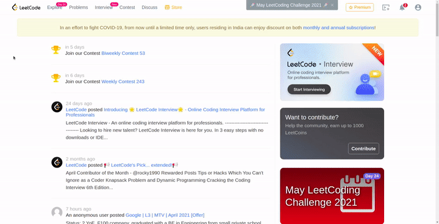
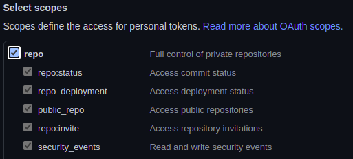

<h1 align="center">
   
  
</h1>

<h4 align="center">A CLI utility integrated with LeetCode for accessing your submissions and many </h4>

    <a href="https://www.python.org/">
    	
    <a href="https://github.com/SocioDroid/leetcode-py-cli/commits/master">
    
    <a href="https://twitter.com/intent/tweet?text=Try leetcode-py-cli which connects your leetcode profile with CLI. Download / View, your submissions. Integrated with github to push your submissions without any hastle&url=https://github.com/SocioDroid/leetcode-py-cli">
    

  <a href="#about">About</a> •
  <a href="#features">Features</a> •
  <a href="#installation">Installation</a> •
  <a href="#usage">Usage</a> •
  <a href="#github-integration">Github Integration</a> • 
  <a href="#credits">Credits</a>

---

## About

<table>
<tr>
<td>
leetcode-py-cli is a CLI utility to interact with LeetCode. We came up with this utility when we tried to upload our solutions to the Github repo, 
but found it to be a very tedious task to manually fetch the submissions.
We couldn't find any open source app which can fetch all the submissions that have been made by us. This is a 2-days fun project made out of curiosity.
We added some more features such as listing valid sumbissions, downloading individual submission, integrated it with github to auto-create a repo and push the
codes to it.
</td>
</tr>
</table>

## Features
<h1 align="left">
  </a>
   
</h1>

 - **Async support** to fetch all submissions.
 - Uses **LeetCode's GraphQL** to fetch data.
 - **Github's REST API** integration to auto-create repository.
 - Retrieve & push new submissions on the go.

## Installation

##### Downloading and installing steps:
* **[Download](https://github.com/SocioDroid/leetcode-py-cli/archive/main.zip)** the latest version of the repo or clone it using 

		git clone https://github.com/SocioDroid/leetcode-py-cli.git
* Install dependencies 
          
        pip install -r requirements.txt 

##### Signing In
* LeetCode is protected by reCAPTCHA which restricts us to sign in directly. So instead we'll be using the session token to authorize the user. 
	#### Step 1 
	 Sign In to [LeetCode](https://leetcode.com/accounts/login/) using your browser as you would normally do.
	#### Step 2
	 We need the `csrftoken` & `LEETCODE_SESSION` cookie which can be easily fetched using the browser devtools. 
	  	
	#### Step 3
	 To login, run the following command and paste the cookies.

	  $ python3 leetcode-py-cli.py -l                     
		                                
	   Enter LEETCODE_SESSION : <your LEETCODE_SESSION>
	   Enter csrftoken : <your csrftoken>

## Usage
	$ python3 leetcode-py-cli.py -h
This will display help for the tool. Here are all the options it supports.

|          Command      |        Description                         |      Example                          |
|-----------------------|--------------------------------------------|---------------------------------------|
| -h, --help            | Show help and usage of tool                | leetcode-py-cli.py -h    |
| -l, --login           | Login to LeetCode                          | leetcode-py-cli.py -l    |
| -s id, --submission id| Download specific submission from LeetCode | leetcode-py-cli.py -s 10 |
| -a, --all             | Download all submissions from LeetCode     | leetcode-py-cli.py -a    |
| -f, --force-update    | Forcefully update all solution             | leetcode-py-cli.py -f    |
| -ls, --list-questions | List solved questions with statistics      | leetcode-py-cli.py -ls   |
| -g, --github          | Push your code to github                   | leetcode-py-cli.py -g    |
| -v, --version         | Show program's version number              | leetcode-py-cli.py -v    | 

## Github Integration
leetcode-py-cli will automatically push your submissions to a github repo and later update it regularly once new submissions are made.
#### Step 1
Visit https://github.com/settings/tokens and generate a personal access token.
Select the scope as follows:
		

#### Step 2
Run the tool with the `-g` option which will download all the submissions and create a new repo only for the first time. 

	$ python3 leetcode-py-cli.py -g
	
	Enter Github token : <your personal access token>
	
	✔ Questions loaded successfully
	✔ Submissions loaded successfully
	✔ Files saved successfully at submissions/
	✔ Collected required details
	
	Enter the name of the repository: leetcode

	✔ Repo has been successfully created. You can view it here:
	https://github.com/SocioDroid/leetcode/

Check out **[this repo](https://github.com/SocioDroid/leetcode/)** which was created using leetcode-py-cli

## TO DO
- [ ] Implement inplace code submisson
- [ ] Display other statistics
- [ ] Execute test cases
- [ ] Display problem statements 
  

## Credits
|  	| 		|
|:---------------------------------------------------------------------------------------------------------:	|:------------------------------------------------------------------------------------------------------------------------------------------------:		|
|                                            **Aishwarya Kendle**                                            	|                                                           **Rushikesh Zanwar**                         			                          	    |

## Contributing

Got **something interesting** you'd like to **share**. 
Feel free to open a pull request !
